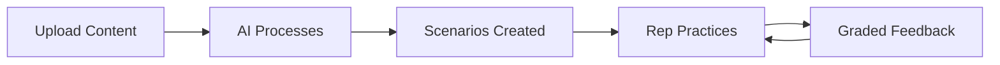
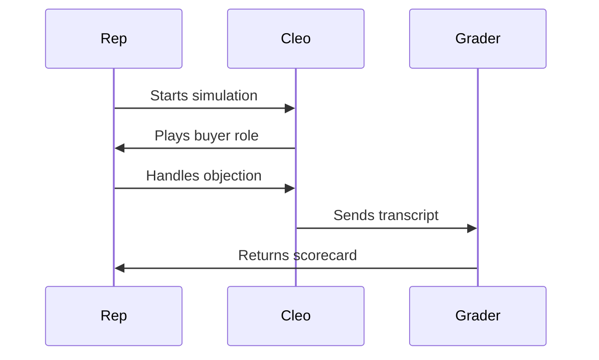

# Cleo — AI Sales Training Partner

Cleo is an AI-powered sales training partner that helps businesses improve sales education through training models, interactive simulations, intelligent grading, and real-time AI voice interactions.

**Live site:** https://ebarronh.github.io/buildathon-mar-26/

---

## Writing Blog Posts

### Create a new post

Add a file to `_posts/` with this naming format:

```
_posts/YYYY-MM-DD-your-title-here.md
```

Example: `_posts/2026-03-05-week-2-building-the-voice-pipeline.md`

### Front matter

Every post starts with front matter:

```yaml
---
title: "Week 2: Building the Voice Pipeline"
date: 2026-03-05
author: Cleo Team
image: /assets/images/week-2-cover.jpg
---
```

| Field | Required | Description |
|-------|----------|-------------|
| `title` | Yes | Post title, displayed on blog listing and post page |
| `date` | Yes | Publication date (`YYYY-MM-DD`) — must match filename date |
| `author` | No | Defaults to "Cleo Team" |
| `image` | No | Hero image path — shown on blog card and at top of post. If omitted, no image is shown |

### Post content

Write the body in Markdown below the front matter. Standard Markdown is supported: headings, bold, italic, lists, links, blockquotes, code blocks, etc.

---

## Images

### Directory

All images go in:

```
assets/images/
```

### Hero image (post cover)

This is the main image for a blog post. It appears:
- On the **blog listing page** as the card image (16:9 crop)
- At the **top of the post** as a full-width banner

**Recommended size:** 1520 x 856px (16:9 aspect ratio, retina-ready)

**Format:** JPG for photos, PNG for screenshots/graphics. Keep file size under 500KB — compress with [Squoosh](https://squoosh.app/) or similar.

**Naming convention:** Match the post filename. If the post is `2026-02-26-week-1-finding-the-problem.md`, the hero image should be `week-1-finding-the-problem.jpg`. Content images for that post use the same prefix: `week-1-finding-the-problem-diagram.png`, `week-1-finding-the-problem-whiteboard.jpg`, etc.

**Usage:** Set the `image` field in post front matter:

```yaml
image: /assets/images/week-2-building-the-voice-pipeline.jpg
```

If no `image` is set, the blog card and post page simply skip the image area — no broken placeholder.

### Content images (inside articles)

These are images embedded within the post body. They animate in on scroll.

**Recommended size:** 1520px wide (matches the 760px post container at 2x retina). Height is flexible.

**Usage:** Standard Markdown image syntax:

```markdown

```

**Example in a post:**

```markdown
## The Architecture

Here's how the voice pipeline connects to the grading system:


The key insight was keeping latency under 500ms...
```

---

## Tables

Standard Markdown tables are supported and styled automatically:

```markdown
| Metric | Before Cleo | After Cleo |
|--------|-------------|------------|
| Ramp time | 12 weeks | 4 weeks |
| Win rate | 22% | 38% |
| Rep confidence | Low | High |
```

---

## Mermaid Diagrams

Mermaid diagrams render automatically. Wrap your diagram in a `mermaid` code block:

````markdown

````

Other diagram types work too — sequence diagrams, state diagrams, etc:

````markdown

````

---

### Image checklist

- [ ] File is in `assets/images/`
- [ ] Max width 1520px
- [ ] Compressed (under 500KB for photos)
- [ ] Descriptive filename (kebab-case)
- [ ] Alt text describes the image content

---

## Local Development

```bash
bundle install
bundle exec jekyll serve
```

Site runs at `http://localhost:4000/buildathon-mar-26/`

---

## Deployment

Push to `main` and GitHub Actions builds and deploys automatically. The workflow runs Jekyll 4.x and deploys to GitHub Pages.
