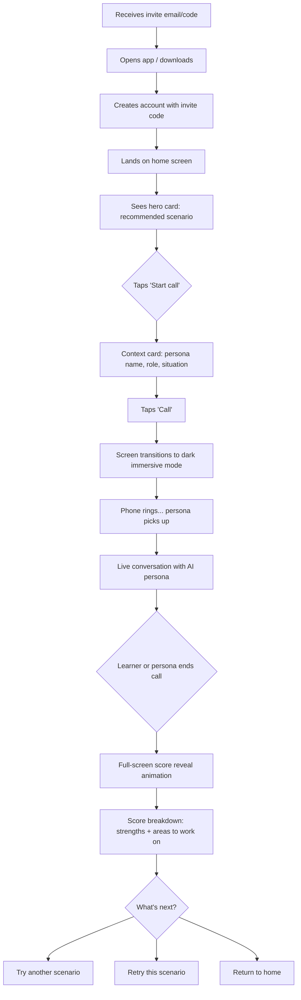
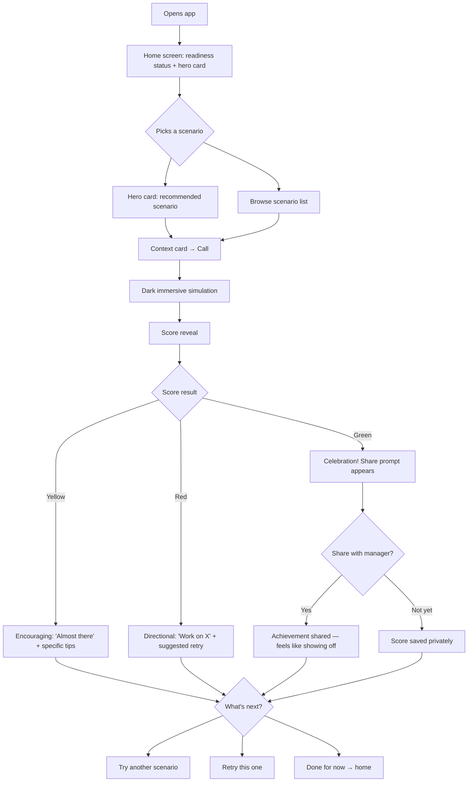
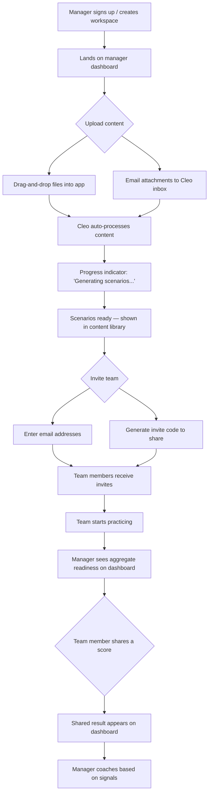
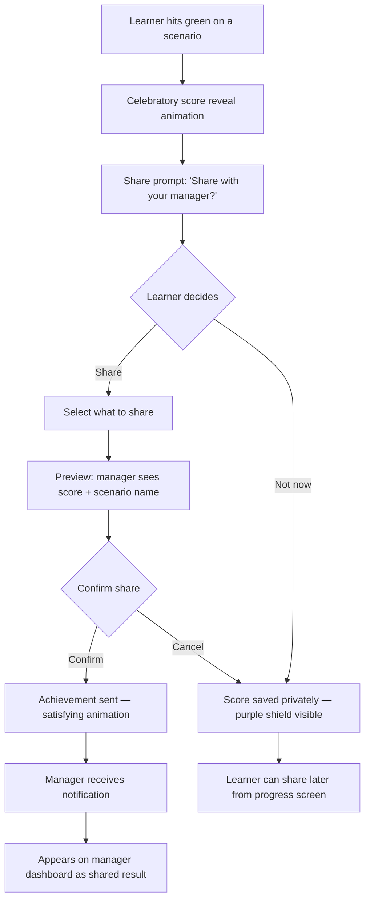
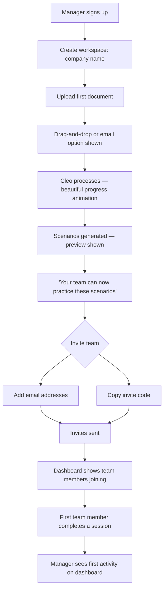

# UX Design Specification buildathon-mar-26

**Author:** Cleo Team
**Date:** 2026-03-06

---

## Executive Summary

### Project Vision

Cleo & You is an AI-powered corporate learning platform that transforms a company's existing knowledge — documents, playbooks, PDFs, SOPs — into personalized learning experiences. The MVP focuses on realistic AI voice simulations for sales teams: upload your content, practice customer calls with an AI that feels real, get scored, and share results when you're ready.

The platform is mobile-first, designed for learners who practice at their desk before real calls and on the commute. Privacy-first is a core design principle — learners own their learning journey, and managers only see aggregate readiness signals unless the learner explicitly chooses to share more.

### Target Users

**Primary — Learner (e.g., Jordan, Sales Rep):** Comfortable with technology, mobile-first. Needs multiple ways to practice — quick sessions on the commute, focused prep at their desk. Motivated by confidence, not compliance. Controls what managers see.

**Primary — Content Owner (e.g., Priya, Sales Manager):** Uploads content via drag-and-drop or email attachments. Needs the transformation from raw docs to practice-ready simulations to feel instant and magical. Sees team readiness at a glance (green/yellow/red aggregate) without surveillance into individual learning curves.

**Secondary — Admin (Alex, Head of Enablement):** Manages company account, content libraries, and team assignments. Needs easy setup with no IT dependency.

**Secondary — Buyer (VP of Sales):** Cares about ROI metrics — faster ramp, readiness proof, tie to revenue outcomes.

### Key Design Challenges

1. **Voice simulation on mobile** — The core experience must feel as natural as a real phone call. Minimal UI, clear controls, no friction — while still surfacing real-time context without clutter.
2. **Privacy-first as a felt experience** — The boundary between what's private and what's shared must be visible, trustworthy, and controlled by the learner. Not just a policy — a UX principle baked into every screen.
3. **Scoring that motivates, not demoralizes** — Green/yellow/red scoring must frame the learning curve as progress, not judgment. Especially critical since early learners will naturally start at red.
4. **Content ingestion that feels instant** — Drag-and-drop or email upload must feel fast and magical, with clear status feedback during processing.

### Design Opportunities

1. **The "real call" feeling** — Minimal chrome, ambient UI, micro-animations for mood shifts and score reveals. The simulation should feel like picking up the phone, not using a training app.
2. **Commute-friendly practice** — Audio-only modes, quick 5-minute sessions, seamless pause/resume. Mobile-first design that respects the context of use.
3. **Learner confidence journey** — A beautifully designed personal progress view (private by default) that celebrates growth. The moment of choosing to share a green score should feel like an achievement.
4. **Emerald green + casual craft** — Native apps with opinionated, detail-obsessed design. Micro-animations, intentional interactions, premium feel. Cleo should feel personal and distinctive — not like another enterprise SaaS tool.

## Core User Experience

### Defining Experience

The core experience of Cleo & You is a realistic AI voice simulation that feels like picking up the phone and talking to a real prospect. The learner taps "Practice," selects a scenario, and within seconds is in a live conversation with an AI persona that knows their company's products, uses real objections, makes small talk, and doesn't always play nice.

Everything in the product radiates outward from this moment. Content ingestion exists to power simulations. Scoring exists to show progress. Sharing exists to prove readiness. The simulation is the product.

### Platform Strategy

**Native mobile-first (iOS and Android)** — purpose-built to leverage platform capabilities:
- Haptics for immersive simulation feedback
- Earpiece speaker and proximity sensor for realistic call feel
- Dynamic Island for active simulation status
- Apple Watch for session scores and quick practice reminders
- Home screen widgets for practice nudges and readiness status
- Offline-first architecture — app is usable immediately with pre-generated content

**Web application** — available as a complementary platform for desktop use at work. Full functionality, but mobile is the primary design target.

**Offline-first design** — Content, once generated, is available offline. Learners can review scenarios, practice with pre-generated simulations, view scores and progress — all without connectivity. Live AI voice calls require connectivity, but the app should never feel "disconnected."

### Effortless Interactions

- **Starting a practice session** — Zero friction. Open the app, tap practice, you're in a call. No tutorials, no setup wizards, no "are you ready?" confirmations.
- **Content upload for managers** — Drag-and-drop or email attachments. The transformation from raw docs to practice-ready scenarios should feel instant and magical.
- **Switching contexts** — Pause a session on mobile, resume at your desk. Pick up where you left off on any device.
- **Offline transitions** — No visible "offline mode." The app simply works. Content is there. Scores are there. When connectivity returns, everything syncs silently.

### Critical Success Moments

1. **First simulation** — Learner hears a realistic voice within seconds of tapping "Practice." Immediate reaction: "this feels real."
2. **The score reveal** — Session ends with an animated score. Green = celebration. Yellow = encouragement. Red = clear direction. Never punishing.
3. **The share moment** — Hitting green triggers an achievement-style prompt to share with their manager. Feels like showing off, not reporting.
4. **Manager's first upload** — Drag in a playbook, team has practice scenarios within minutes. "I didn't have to build anything."
5. **Commute practice** — Open the app on the train, pick a 5-minute scenario, practice offline. Seamless.

### Experience Principles

1. **Instant, always** — Offline-first. No loading states, no "connecting..." The app is ready the moment you open it.
2. **Feels real, not like training** — The simulation is the product. Minimal chrome. The call experience feels closer to a phone call than a learning app.
3. **Opinionated and delightful** — Every interaction is intentionally designed. Micro-animations, haptics, Dynamic Island, widgets. Craft is the brand.
4. **Progress, not pressure** — Scoring motivates growth. Privacy protects the journey. Sharing is a celebration, not a requirement.
5. **Platform-native, not cross-platform** — Leverage everything iOS and Android offer. This is why it's native.

## Desired Emotional Response

### Primary Emotional Goals

**Confidence through challenge.** Learners earn their confidence by practicing tough, realistic scenarios — not by being coddled with easy wins. The product respects learners enough to be difficult. The emotional arc of every session moves from nervous anticipation to earned confidence.

**For managers:** Confidence in their team. Priya doesn't need to hover or micromanage — she sees aggregate readiness and feels confident sending her people to the conference, the product launch, the big meeting.

### Emotional Journey Mapping

| Stage | Learner Feels | Manager Feels |
|---|---|---|
| **First open** | Curiosity, intrigue — "this looks different" | Relief — "this was easy to set up" |
| **First simulation** | Nervous excitement — like before a real call | — |
| **During practice** | Focused intensity — the call is tough, demanding | — |
| **After a tough session (red/yellow)** | Relief and momentum — "glad I did that, on to the next one" | — |
| **After hitting green** | Pride and accomplishment — "I earned this" | — |
| **Choosing to share** | Showing off — "look what I can do" | Confidence — "my team is ready" |
| **Returning to practice** | Eagerness — "I want to get better" | Trust — "the system is working" |
| **Something goes wrong** | Patience — "I trust this app, it'll sort itself out" | — |

### Micro-Emotions

**Prioritized emotional states for Cleo:**

- **Confidence over confusion** — Every screen, every interaction should make the learner feel capable and in control
- **Trust over skepticism** — Privacy boundaries are visible and felt, not just promised
- **Accomplishment over frustration** — Even red scores frame the path forward, never the failure
- **Excitement over anxiety** — Tough simulations should feel like a challenge to rise to, not a test to dread
- **Delight over mere satisfaction** — The craft, the micro-animations, the details — using Cleo should feel like using a product someone deeply cared about

### Design Implications

- **Confidence through challenge** — Simulations don't pull punches, but the UI wraps the experience in encouragement. Tough AI persona + warm, supportive interface.
- **Relief and momentum** — Post-session screens emphasize "what's next" over "what went wrong." Progress is forward-looking.
- **Pride in sharing** — The share flow should feel like an achievement unlock, not a form submission. Celebratory animation, not a checkbox.
- **Trust in privacy** — Privacy controls are always visible, never buried in settings. The learner sees exactly what's private and what's shared at all times.
- **Delight in craft** — Micro-animations on score reveals, haptic feedback during simulations, beautiful transitions. Every detail says "someone cared about this."
- **No corporate dread** — Casual tone, emerald green warmth, friendly copy. Cleo feels like a coach, not a compliance tool.

### Emotional Design Principles

1. **Earn it, don't give it** — Confidence comes from tough practice, not easy wins. The product challenges learners because it believes in them.
2. **Forward, always forward** — Every interaction points to the next step, the next improvement, the next session. Never dwell on failure.
3. **Your space, your pace** — Privacy isn't a feature, it's an emotion. Learners should *feel* safe to fail, experiment, and grow without observation.
4. **Craft is care** — Beautiful design communicates respect. Every micro-animation, every transition, every detail tells the learner: "we made this for you."
5. **Anti-corporate** — Cleo should never feel like enterprise software. Casual, honest, warm. A coach who happens to be an app.

## UX Pattern Analysis & Inspiration

### Inspiring Products Analysis

**Tesla Mobile App**
- Minimal, dark UI with a single focal point — open the app and instantly know everything about your car's status
- Controls feel physical with haptic feedback and smooth animations
- Offline-resilient with cached state — no loading spinners, no "connecting..." screens
- Status at a glance without requiring navigation
- **Lesson for Cleo:** The "open and instantly know" pattern. Learner opens Cleo and immediately sees readiness status, recent sessions, what to practice next. No digging required.

**Apple Music**
- Beautiful full-screen immersive experiences (Now Playing, lyrics, album art)
- Seamless transitions between browsing and deep listening
- Leverages every platform capability — spatial audio, haptics, Dynamic Island, widgets
- Offline-first with intelligent downloads and silent sync
- **Lesson for Cleo:** The transition from browsing scenarios to being *in* a simulation should feel like tapping play — instant immersion. The simulation screen should be as full-screen and distraction-free as Now Playing.

**Linear**
- Blazing fast, zero loading states, keyboard-first on web
- Opinionated workflows — doesn't try to be everything for everyone
- Beautiful typography and information density done right
- Every interaction feels intentional and crafted — nothing is accidental
- **Lesson for Cleo:** The web experience and manager-facing screens should channel Linear's speed and intentionality. Dense information presented beautifully. No bloat, no unnecessary features.

**Google NotebookLM (cautionary inspiration)**
- Correct concept: upload your content, AI transforms it into learning formats
- Falls short: too slow, too generic, too limited in output formats
- No company-specific personalization, no realistic practice
- **Lesson for Cleo:** Same "upload and transform" promise, but executed with speed, specificity, and craft. Cleo must feel instant where NotebookLM feels sluggish. Bespoke where NotebookLM feels generic.

### Transferable UX Patterns

**Navigation Patterns:**
- **Tesla's "status at a glance" home screen** — Learner home screen shows readiness, recent sessions, and next recommended practice without any navigation. One screen, complete picture.
- **Apple Music's browse-to-immerse transition** — Scenario selection flows seamlessly into full-screen simulation. No confirmation dialogs, no loading screens. Tap and you're in.

**Interaction Patterns:**
- **Apple Music's Now Playing as simulation screen** — During a voice simulation, the screen is fully immersive. Minimal controls (end call, mute). The conversation is the entire experience.
- **Tesla's haptic controls** — Physical-feeling interactions throughout. Score reveals, session transitions, button presses — everything has tactile feedback.
- **Linear's speed** — Every action completes instantly. No spinners, no "please wait." Offline-first architecture makes this possible.

**Visual Patterns:**
- **Linear's information density** — Manager dashboards show team readiness with beautiful typography and smart use of space. Dense but never cluttered.
- **Tesla's dark, focused UI** — Simulation screens could use a dark, focused aesthetic to create immersion and reduce distraction.
- **Apple Music's full-screen art** — Post-session score reveals deserve a full-screen, animated, celebratory moment.

### Anti-Patterns to Avoid

- **NotebookLM's loading and processing delays** — Content transformation must feel instant. If processing takes time, show progress beautifully and let the learner do something else meanwhile.
- **Enterprise dashboard bloat** — No 47-tab navigation, no settings pages with 200 toggles. Opinionated defaults, minimal configuration.
- **Onboarding wizards and tutorials** — Tesla doesn't explain itself. Neither should Cleo. The app should be self-evident.
- **Completion-theater UX** — No progress bars that measure "modules completed." No badge collections. No confetti for finishing a mandatory module. Cleo measures readiness, not compliance.
- **Generic AI interactions** — No "I'm an AI assistant, how can I help you?" The AI persona in simulations has a name, a mood, a personality. It feels like a person, not a chatbot.

### Design Inspiration Strategy

**What to Adopt:**
- Tesla's instant status home screen — open Cleo, know everything immediately
- Apple Music's full-screen immersive transitions — browsing to simulation is seamless
- Linear's speed and zero-loading-state philosophy — offline-first makes this real
- Apple Music's platform-native integration — Dynamic Island, widgets, haptics, Watch

**What to Adapt:**
- Tesla's dark focused UI — adapt for simulation screens specifically, while keeping emerald green warmth for the broader app experience
- Linear's information density — adapt for manager dashboards, simplified for the learner's personal view
- Apple Music's offline downloads — adapt for pre-generated simulation content that's always available

**What to Avoid:**
- NotebookLM's sluggishness and generic feel — speed and specificity are non-negotiable
- Enterprise LMS patterns — no compliance theater, no badge walls, no mandatory module tracking
- Generic onboarding flows — the app teaches by doing, not by explaining

## Design System Foundation

### Design System Choice

**Platform-Native Foundation + Custom Design Layer**

- **iOS:** SwiftUI with custom design tokens, components, and animations
- **Android:** Jetpack Compose with matching custom design layer
- **Web:** Tailwind CSS with custom shadcn/ui components
- **Shared:** Unified design tokens (colors, typography, spacing, animation curves) across all three platforms

### Rationale for Selection

1. **Platform-native is a core principle** — SwiftUI and Jetpack Compose enable full access to Dynamic Island, widgets, Apple Watch, haptics, and every platform capability. Cross-platform frameworks would compromise the "this is why it's native" promise.
2. **Opinionated design requires custom components** — Tesla, Apple Music, and Linear don't use off-the-shelf component libraries. Cleo's craft-heavy, intentional design needs custom components built on native foundations.
3. **Tailwind + shadcn is perfect for a 2-person team** — Fast development with full customization control. No fighting a component library's opinions — you define the opinions.
4. **AI-assisted development** — A 2-person team with AI tools can build and maintain custom components efficiently, especially with clear design tokens and patterns documented.

### Implementation Approach

**Design Token System (shared across platforms):**
- Color palette anchored on emerald green with supporting neutrals
- Typography scale — casual, friendly, high-quality typefaces
- Spacing and sizing scale — consistent rhythm across all screens
- Animation curves and durations — shared timing for micro-animations
- Haptic patterns — defined feedback patterns for iOS and Android

**Component Strategy:**
- **iOS:** Custom SwiftUI components wrapping native patterns. Full-screen simulation view, score reveal animations, scenario cards, privacy indicators.
- **Android:** Matching Jetpack Compose components with Material 3 as a sensible base layer, heavily customized to match Cleo's visual identity.
- **Web:** Custom shadcn/ui components styled with Tailwind. Manager dashboard, content upload, team readiness views. Channel Linear's information density.

### Customization Strategy

**Brand Expression:**
- Emerald green as the primary accent — warm, not clinical
- Dark mode simulation screens (inspired by Tesla) for immersion
- Light mode for browsing, progress, and manager views — friendly and open
- Micro-animations on every meaningful interaction — score reveals, transitions, status changes
- Custom iconography — not generic, not corporate

**Platform-Specific Customization:**
- iOS: SF Symbols extended with custom icons, native haptic engine integration, Dynamic Island live activities
- Android: Material You dynamic theming adapted to Cleo's palette, custom ripple effects
- Web: Keyboard shortcuts (Linear-inspired), responsive but desktop-optimized for manager workflows

**Design System Maintenance (2-person team):**
- Design tokens defined once, consumed by all three platforms
- Component documentation lives alongside code — no separate design system site
- AI tools for generating component variations and maintaining consistency
- Mobile leads, web follows — new patterns start on iOS, adapt to Android and web

## Defining Experience

### The One-Line Description

"Practice a realistic call with an AI coach partner who knows your company — and feel ready for the real thing."

Like Tinder's swipe or Spotify's instant play, Cleo's defining moment is: tap Practice, hear a ring, and you're in a conversation that feels real. The learner's mental model isn't "training" — it's "sparring with a coach partner who helps me level up."

### User Mental Model

**The coach partner metaphor.** Learners should think of Cleo as a sparring partner, not a testing system. Like a tennis coach who hits you tough shots so you're ready for the match — not a referee keeping score.

**Current pain points this replaces:**
- **Shadowing** — Passive, unscalable, dependent on someone else's schedule. You watch but never do.
- **Demo presentations** — One-directional. You rehearse a monologue, not a conversation. No pushback, no objections, no unpredictability.
- **Going cold to conferences/networking** — Terrifying with no practice. You show up and hope for the best. No safe space to prepare for real conversations.
- **Role-play with colleagues** — Awkward, inconsistent, never feels real. Colleagues are too nice or don't know the material well enough.

**Cleo replaces all of these** with a single experience: realistic practice that's always available, always tough, and always private.

### Success Criteria

| Criteria | What It Means | How We Know |
|---|---|---|
| **"This feels real"** | The simulation is immersive enough that learners forget they're practicing | Learners describe nervousness, describe the persona as a "person," use phrases like "they said" not "it said" |
| **"I want to do another one"** | The experience is challenging but rewarding enough to drive repeat sessions | Learners voluntarily return without being prompted. Multiple sessions per week. |
| **"I feel ready now"** | Practice translates to real-world confidence | Learners voluntarily share green scores. They practice before specific real events (calls, conferences, launches). |
| **"This just works"** | Zero friction from opening the app to being in a call | Under 10 seconds from app open to hearing the persona's voice |
| **Instant feedback** | Learners know how they're doing without waiting | Real-time persona reactions during the call + immediate score reveal after |

### Novel UX Patterns

**Combining familiar patterns in an innovative way:**

The core interaction uses a familiar metaphor (phone call) with novel elements:
- **Familiar:** The call screen looks and feels like a real phone call — full screen, dark, minimal controls. Everyone knows how to make a phone call.
- **Novel:** The persona reacts dynamically to your performance. Mood shifts, patience levels, engagement — these are real-time feedback loops disguised as natural conversation.
- **Novel:** Post-call score reveal is an achievement moment, not a report card. Inspired by gaming (score screens) and fitness apps (workout summaries), not enterprise LMS.
- **Familiar:** The "share" action uses the same mental model as sharing a fitness achievement — "look what I did" — not filing a training report.

**No user education needed.** Everyone knows how to make a phone call. Everyone understands green/yellow/red. The novel elements (dynamic persona, score-as-achievement) are discovered naturally through use.

### Experience Mechanics

**1. Initiation**
- Open app → home screen shows readiness status at a glance (Tesla pattern)
- Recommended scenario front and center, or browse to choose
- Tap scenario → brief context card: persona name, their role, the situation ("Sarah, VP of Marketing at a mid-size e-commerce company, evaluating your product")
- Tap "Call" → screen transitions to dark, immersive call view. It rings. They pick up.
- Total time from app open to hearing a voice: under 10 seconds

**2. Interaction**
- Full-screen, dark, immersive — inspired by Apple Music's Now Playing
- AI persona leads naturally: small talk first, then business, then pushback, tough questions, impatience
- Minimal controls: mute, end call, subtle "hint" button for stuck learners
- Haptic feedback on key moments — mood shifts, tough objections landing
- The persona's natural reactions ARE the real-time feedback — engagement when you're doing well, impatience when you're not

**3. Feedback**
- Subtle visual cues during the call — gentle pulse or color shift indicating conversation trajectory (not distracting)
- Persona behavior is the primary feedback loop: they lean in or pull away based on performance
- No interruptions, no pop-ups, no "you should try..." during the call

**4. Completion**
- Persona wraps the call naturally, or learner ends it
- Transition to full-screen score reveal — animated, celebratory, green/yellow/red
- Breakdown view: what went well, what to work on, specific moments from the call highlighted
- Forward-looking: "What's next" — suggested next scenario or retry
- Optional share prompt: achievement-style, not a form. "Share with your manager?"
- Haptic celebration on green. Encouraging haptic on yellow/red with clear "next step" energy.

## Visual Design Foundation

### Color System

**Primary — Emerald Green**
- `#10B981` — Primary emerald (vibrant, warm, not clinical)
- `#059669` — Primary dark (buttons, active states)
- `#34D399` — Primary light (highlights, success indicators)
- `#ECFDF5` — Primary tint (subtle backgrounds, light mode)

**Score Colors:**
- Green: `#10B981` (primary emerald — green score = brand color = celebration)
- Yellow: `#F59E0B` — Warm amber, encouraging, not warning
- Red: `#EF4444` — Softened red, directional not alarming

**Neutrals — Cool Grays**
- `#F9FAFB` — Background light
- `#F3F4F6` — Surface light
- `#6B7280` — Secondary text
- `#374151` — Primary text (light mode)
- `#1F2937` — Surface dark
- `#111827` — Background dark (simulation screens)
- `#030712` — Deep dark (true immersion)

**Semantic Colors:**
- Success: Primary emerald (`#10B981`)
- Warning: `#F59E0B`
- Error: `#EF4444`
- Info: `#3B82F6`
- Private/Shield: `#8B5CF6` — Purple accent for privacy indicators (distinct, trustworthy)

### Typography System

**Platform Fonts:**
- iOS: San Francisco (SF Pro for UI, SF Mono for scores/metrics)
- Android: Roboto (Roboto Mono for scores/metrics)
- Web: Inter + JetBrains Mono for metrics

**Type Scale (mobile-first):**
- Display: 34pt / bold — score reveals, celebratory moments
- H1: 28pt / bold — screen titles
- H2: 22pt / semibold — section headers
- H3: 18pt / semibold — card titles, scenario names
- Body: 16pt / regular — readable, comfortable
- Caption: 14pt / regular — secondary info, timestamps
- Micro: 12pt / medium — badges, labels, subtle metadata

**Tone:** Casual, friendly, confident. No ALL CAPS headers. Sentence case everywhere. Typography should feel like a friend talking, not a corporation announcing.

### Spacing & Layout Foundation

**Base Unit:** 8px grid system
- Tight: 4px (within components)
- Base: 8px (related elements)
- Comfortable: 16px (between components)
- Spacious: 24px (section separation)
- Breathe: 32px+ (major sections, screen padding)

**Layout Principles:**
- **Learner mobile** — Spacious, breathing. Generous padding (24-32px). Large touch targets (44pt minimum). Cards with room to breathe. The app should feel calm and focused.
- **Manager web** — Denser, Linear-inspired. Tighter spacing (16-24px). More information per screen. Tables, lists, dashboards that respect the user's time.
- **Simulation screen** — Near-zero chrome. Full bleed. The content IS the interface. Only essential controls visible.

**Dark/Light Mode Strategy:**
- **Light mode (default)** — Cool gray backgrounds, emerald accents. Home, browsing, progress, settings. Friendly and open.
- **Dark mode (simulation)** — Deep dark backgrounds (`#030712`), minimal UI. Active calls and score reveals. Immersive and focused. Transitions between modes are smooth and cinematic.
- **System dark mode** — Full app dark mode available for users who prefer it system-wide.

### Accessibility Considerations

- All text meets WCAG AA contrast ratios (4.5:1 for body, 3:1 for large text)
- Touch targets minimum 44x44pt on mobile
- Color is never the only indicator — scores use color + text + icon
- Reduced motion support — micro-animations respect OS accessibility settings
- Dynamic Type support on iOS, font scaling on Android

## Design Direction Decision

### Design Directions Explored

Six visual directions were generated and evaluated through an interactive HTML showcase (`ux-design-directions.html`):

1. **Minimal Zen** — Ultra-clean, spacious, Tesla-inspired. Readiness score as focal point.
2. **Bold Cards** — Large hero cards, strong CTAs, fintech-inspired energy.
3. **Dark Immersive** — Fully dark, gaming/audio UI, performance dashboard feel.
4. **Playful Coach** — Warm, motivational, fitness-app-inspired streaks and progress.
5. **Manager Dashboard** — Linear-inspired density for team readiness views.
6. **Context-First** — Event-aware suggestions, prominent privacy badge, weekly rhythm.

### Chosen Direction

**Direction 2: Bold Cards** — selected as the primary visual direction for the learner experience.

**Key elements:**
- Large, colorful hero card that surfaces the most relevant practice scenario
- Emerald green gradient hero with white CTA button — impossible to miss
- Scenario list below with distinct icons and clear visual hierarchy
- Clean white background with subtle gray cards for secondary content
- The primary action (start a practice call) dominates the screen
- Casual, confident typography — "cleo" wordmark in bold emerald

**Combined with elements from other directions:**
- **Direction 1's simulation and score screens** — Dark, immersive call screen with pulsing avatar and minimal controls. Full-screen animated score reveal.
- **Direction 5's manager dashboard** — Linear-inspired web layout with sidebar navigation, team readiness cards, and aggregate signals. Privacy-respecting by design.
- **Direction 6's privacy badge** — The purple shield "Private" badge concept carries into the Bold Cards direction, making privacy visible at all times.

### Design Rationale

1. **Action-first design** — The hero card puts the most relevant practice scenario front and center. One tap to practice. Matches the "under 10 seconds to a voice" goal.
2. **Scenarios as destinations** — Each scenario card has a distinct icon and personality, making the list feel like places to explore rather than items to complete. Supports the coach partner mental model.
3. **Light and energetic** — The white/emerald palette feels approachable and anti-corporate. Contrasts with the dark immersive simulation screens, making the transition into a call feel like entering a focused zone.
4. **Scalable for future modalities** — The card-based layout naturally accommodates additional learning modes (podcasts, Q&A, reading) as they're added in future phases. Each modality becomes a new card type.
5. **Clear mode separation** — Light for browsing/progress (learner home), dark for immersion (simulation + score), Linear-dense for management (web dashboard). Three distinct but cohesive experiences.

### Implementation Approach

**Learner Mobile (Bold Cards + Immersive Simulation):**
- Home screen: White background, emerald gradient hero card, scenario list with icons
- Scenario cards: Rounded corners (16-24px), subtle shadows, clear status indicators
- Active simulation: Full dark mode, minimal controls, pulsing avatar, ambient feedback
- Score reveal: Dark background, animated score circle, breakdown list, share CTA
- Transitions: Smooth, cinematic shift from light home to dark simulation — feels intentional

**Manager Mobile (Compact Dashboard):**
- Simplified version of web dashboard
- Team readiness cards with green/yellow/red status pills
- Content library list with scenario generation counts
- Upload via drag-and-drop or camera/file picker

**Manager Web (Linear-Inspired):**
- Left sidebar navigation: Team readiness, Content library, Upload, Settings
- Main content area: Team cards with progress bars and shared session counts
- "Aggregate view — only shared results are visible" always displayed
- Keyboard shortcuts for power users (Linear-inspired)
- Dense but clean — beautiful typography, smart spacing

## User Journey Flows

### Journey 1: Learner First Practice Session

**The most critical journey — this is where the aha moment lives.**

Jordan gets invited by their manager, opens the app, and within minutes is in a realistic practice call.

**Key design decisions:**
- No onboarding tutorial — the app is self-evident
- Hero card on home screen means the first action is obvious
- Context card before call sets expectations without slowing down
- Under 10 seconds from home to hearing a voice
- Score reveal is the emotional payoff — animated, celebratory, forward-looking

### Journey 2: Learner Ongoing Practice Loop

**The core loop that drives daily engagement.**

Jordan opens the app, sees their readiness status and a recommended scenario, practices, and decides what's next.

**Key design decisions:**
- Home screen always shows the most relevant next action (hero card)
- Score result drives different emotional paths (green = celebrate, yellow = encourage, red = direct)
- Share prompt only appears on green — never pressure on yellow/red
- Private by default — the purple shield is always present
- "What's next" always points forward, never dwells

### Journey 3: Manager Content Upload & Team Setup

**Priya's journey — from raw documents to a practicing team.**

**Key design decisions:**
- Zero configuration on upload — Cleo auto-generates everything
- Email upload option means managers can forward docs from anywhere
- Progress indicator is beautiful, not a boring spinner — show what's being generated
- Invite flow is dead simple: emails or a shareable code
- Dashboard shows only aggregate readiness + explicitly shared results
- "No shares yet" for new team members — not "0 score" or "not started"

### Journey 4: Learner Share Achievement

**The privacy-first sharing flow — sharing is a celebration, not a report.**

**Key design decisions:**
- Share prompt only on green scores — never pressure on yellow/red
- Preview shows exactly what the manager will see — full transparency
- "Not now" is never judged — private badge reinforces safety
- Can share later from progress screen — no pressure in the moment
- Sharing animation feels like an achievement unlock, not a form submission
- Manager sees score + scenario name only — not full session transcript

### Journey 5: Manager First-Time Setup

**From zero to a practicing team in minutes.**

**Key design decisions:**
- Minimal steps: name → upload → invite. That's it.
- No configuration, no settings, no "choose your plan" screens during setup
- Preview of generated scenarios gives immediate value before team joins
- Dashboard is useful even with one team member — not empty-state hell
- First activity notification is a dopamine hit for the manager — "it's working"

### Journey Patterns

**Navigation Patterns:**
- **Home as command center** — Every journey starts and returns to the home screen. Home always shows the most relevant next action.
- **Progressive immersion** — Light browsing → context card → dark simulation → score reveal → light home. The mode shift is the journey.

**Decision Patterns:**
- **Binary with graceful default** — Share or not. Retry or next. Never more than 2-3 options at any decision point.
- **Forward momentum** — Every decision point leads somewhere productive. There's no dead end.

**Feedback Patterns:**
- **Score as emotion** — Green/yellow/red isn't data, it's a feeling. The entire post-session experience changes based on the score color.
- **Privacy as constant** — The purple shield badge is visible throughout. Privacy isn't a setting you configure, it's a state you always see.
- **Progress as story** — Readiness percentage, scenario completion, streak counts — all tell a forward-moving story.

### Flow Optimization Principles

1. **Minimum taps to value** — Home → Call in 2 taps. Upload → Scenarios in 1 drag. Invite → Team in 1 paste.
2. **No empty states** — Every screen has something useful even before the user takes action. Hero card is populated from day one.
3. **Emotional momentum** — Flows are designed to build energy: curiosity → nervous excitement → focused practice → relief/pride → forward momentum.
4. **Error as invisible recovery** — If a call drops, resume silently. If upload fails, retry automatically. If offline, show cached content. Never show an error modal if you can fix it yourself.
5. **One path, not many** — Opinionated flows. Don't offer 5 ways to start a practice call. Offer one beautiful way.

## Component Strategy

### Design System Components

**Platform Foundation (used as-is or lightly customized):**

| Component | iOS (SwiftUI) | Android (Compose) | Web (shadcn/Tailwind) |
|---|---|---|---|
| Buttons | Native button styles, emerald tint | Material 3 button, emerald theme | shadcn Button, custom emerald variant |
| Navigation | TabView, NavigationStack | Bottom navigation, NavHost | Sidebar layout (Linear-style) |
| Text fields | TextField with custom styling | OutlinedTextField, emerald focus | shadcn Input |
| Lists | List with custom row components | LazyColumn | Custom card lists |
| Sheets/Modals | .sheet modifier | BottomSheetScaffold | shadcn Dialog/Sheet |
| Toggles | Toggle with emerald tint | Switch, emerald theme | shadcn Switch |
| Progress bars | ProgressView, custom styled | LinearProgressIndicator | Custom Tailwind |

These cover roughly 40% of UI needs. The remaining 60% requires custom components specific to Cleo's experience.

### Custom Components

**1. Hero Scenario Card**

- **Purpose:** Primary CTA on home screen — surfaces the most relevant practice scenario
- **Content:** Scenario title, persona name + mood hint, brief context line, "Start call" button
- **States:** Default (emerald gradient), loading (shimmer), offline-available (subtle indicator), completed (green checkmark overlay)
- **Variants:** Full-width (home hero), compact (widget)
- **Interaction:** Single tap → context card → call. Feels like tapping into a destination.
- **Accessibility:** VoiceOver: "Practice call with [persona], [scenario]. Double tap to start."

**2. Scenario List Card**

- **Purpose:** Secondary scenario options below the hero card
- **Content:** Category icon, scenario title, brief description, readiness status dot
- **States:** Default, pressed (scale down 0.98), completed (green dot), in-progress (yellow dot), not started (gray dot), offline-available
- **Variants:** Standard list item, compact (for browse/search)
- **Interaction:** Tap → context card → call
- **Accessibility:** Status dot has text equivalent ("Ready", "In progress", "Not started")

**3. Simulation Call Screen**

- **Purpose:** The core experience — full-screen immersive voice simulation
- **Content:** Persona avatar (circle with initial), persona name, role/company, call timer, subtle ambient feedback
- **States:** Ringing (avatar pulses, ring animation), connected (steady pulse, timer counting), persona speaking (stronger pulse), learner speaking (subtle mic indicator), mood shift (ambient color change — barely perceptible), call ending (fade transition)
- **Variants:** Single variant — full screen, no variations. Opinionated.
- **Controls:** Mute button, hint button (subtle), end call button (red). Nothing else.
- **Interaction:** Avatar pulses with conversation rhythm. Haptic on mood shifts and key objection moments. Proximity sensor activates earpiece speaker (like a real call).
- **Accessibility:** VoiceOver announces persona responses. Mute/end call buttons are large touch targets. Timer is announced periodically.

**4. Score Reveal**

- **Purpose:** Post-session emotional payoff — shows performance with celebration or encouragement
- **Content:** Large animated score circle (number + color), one-line summary, breakdown list (category + rating), "what's next" actions
- **States:** Green (celebration — confetti-like particle animation, strong haptic), yellow (encouraging — warm glow animation, medium haptic), red (directional — steady reveal, gentle haptic + "here's what to focus on")
- **Variants:** Single variant, but animation/color/copy changes based on score tier
- **Interaction:** Score animates in (scale from 0.5 → 1.1 → 1.0). Breakdown items stagger in. Actions appear last. Share button only appears on green.
- **Accessibility:** Score announced immediately: "Score: 86, green. Great session." Breakdown items readable.

**5. Privacy Shield Badge**

- **Purpose:** Constant visual reminder that the learner's data is private by default
- **Content:** Lock icon + "Private" text
- **States:** Private (purple, default — always visible), shared (emerald, after learner shares a specific score)
- **Variants:** Compact (icon only, for tight spaces), standard (icon + text)
- **Interaction:** Tap → opens privacy settings showing exactly what's private and what's shared
- **Accessibility:** "Privacy status: Private. Your scores are only visible to you. Tap to manage."

**6. Readiness Indicator**

- **Purpose:** Shows learner's readiness level for a topic or overall
- **Content:** Color indicator + text label + optional percentage
- **States:** Green/"Ready", yellow/"Progressing", red/"Getting started", gray/"No data"
- **Variants:** Dot (compact, in lists), pill (with text, in cards), full (with percentage bar, in progress views)
- **Interaction:** Non-interactive in most contexts. Tappable in progress view → shows breakdown.
- **Accessibility:** Color is never the only indicator — always paired with text and/or icon.

**7. Share Achievement Flow**

- **Purpose:** The moment a learner chooses to share a green score with their manager
- **Content:** Preview card showing what manager will see (score + scenario name), confirm/cancel actions
- **States:** Prompt (appears after green score), preview (shows manager's view), confirming (brief loading), sent (celebration animation), cancelled (returns to score screen quietly)
- **Variants:** Post-session prompt (immediate), progress screen share (deferred — "share this past session")
- **Interaction:** Confirm → satisfying send animation (card flies up/away) + haptic + brief "Shared!" confirmation.
- **Accessibility:** Preview clearly describes what will be shared. Confirm action is distinct from cancel.

**8. Content Upload Zone**

- **Purpose:** Manager uploads company documents that power everything
- **Content:** Drop zone with icon, supported formats list, processing status, email upload alternative
- **States:** Empty (inviting drop zone with dashed border), dragging (border highlights emerald, zone expands), processing (beautiful progress animation showing what's being generated), complete (scenarios listed with counts), error (friendly retry, not alarming)
- **Variants:** Full page (first upload), compact (add more content), email instructions (copy Cleo email address)
- **Interaction:** Drag-and-drop or file picker. Processing animation shows stages: "Reading document → Extracting scenarios → Generating personas → Ready!"
- **Accessibility:** Drop zone announced. File picker available as alternative. Processing status announced at each stage.

**9. Team Readiness Card (Manager)**

- **Purpose:** Shows individual team member's shared readiness on manager dashboard
- **Content:** Member avatar/initials, name, role, time on team, readiness bar, status pill, shared session count
- **States:** Ready (green bar + pill), progressing (yellow bar + pill), getting started (red bar + pill), no shares yet (gray, no bar)
- **Variants:** Card (web dashboard grid), row (mobile list), compact (summary view)
- **Interaction:** Tap/click → view shared session details (only what learner explicitly shared).
- **Accessibility:** "Jordan Rivera, Sales Rep, 3 weeks. Status: Ready. Shared 2 sessions."

**10. Context Card**

- **Purpose:** Pre-call briefing that sets the stage for the simulation
- **Content:** Persona avatar + name, their role and company, situation description, mood hint (optional), "Call" button
- **States:** Default (informational), calling (transition animation to dark simulation screen)
- **Variants:** Single variant. Brief and focused.
- **Interaction:** Appears after selecting a scenario. Quick scan (2-3 seconds), then tap "Call" to start.
- **Accessibility:** All persona context read aloud. "Call" button clearly labeled.

### Component Implementation Strategy

**Build order follows user journey criticality:**

| Priority | Component | Reason |
|---|---|---|
| P0 | Simulation Call Screen | The core experience — everything else exists to support this |
| P0 | Score Reveal | The emotional payoff — completes the core loop |
| P0 | Hero Scenario Card | The entry point — gets learners into practice |
| P0 | Context Card | Bridge between browsing and simulation |
| P1 | Scenario List Card | Browse and select scenarios |
| P1 | Privacy Shield Badge | Trust signal — visible from day one |
| P1 | Readiness Indicator | Progress visibility across the app |
| P1 | Content Upload Zone | Manager's primary action |
| P2 | Share Achievement Flow | Privacy-first sharing — important but not day-one critical |
| P2 | Team Readiness Card | Manager dashboard — can start simple |

### Implementation Roadmap

**Phase 1 — Core Loop (MVP launch):**
- Simulation Call Screen + Score Reveal + Hero Scenario Card + Context Card
- These four components deliver the complete practice → score experience
- Minimum viable versions of Scenario List Card and Readiness Indicator

**Phase 2 — Complete Learner Experience:**
- Privacy Shield Badge integrated across all screens
- Share Achievement Flow with full animation
- Polished Scenario List Card with all states
- Full Readiness Indicator variants

**Phase 3 — Manager Experience:**
- Content Upload Zone with processing animations
- Team Readiness Card for dashboard
- Manager-specific navigation and layout components

**Cross-platform approach:**
- Build iOS first (SwiftUI) — it's the primary platform
- Adapt to Android (Jetpack Compose) — match visual identity, respect platform conventions
- Web last (shadcn/Tailwind) — manager-focused, Linear-inspired density
- Shared design tokens ensure visual consistency across all three

## UX Consistency Patterns

### Feedback Patterns

**Success Feedback:**
- **Score reveal** — The primary success moment. Full-screen animation, color-coded, haptic. Never a toast or banner — it deserves the whole screen.
- **Share confirmed** — Card flies away animation + "Shared!" micro-confirmation. Haptic. Returns to score screen naturally.
- **Content processed** — Scenarios appear in the content library with a subtle entrance animation. No "success!" modal.
- **Rule:** Success is celebrated through animation and haptic, never through alert boxes or banners. The UI changes to reflect the new state — that IS the feedback.

**Error Feedback:**
- **Call drops** — Silent auto-reconnect attempt. If it fails, gentle bottom sheet: "Connection lost. Want to retry or save your progress?" Never an error modal.
- **Upload fails** — Inline retry button on the upload zone. Copy: "Couldn't process this file. Try again?" Not "Error 500."
- **Offline action unavailable** — Subtle inline message where the action would be: "You're offline — this will be available when you reconnect." No blocking modals.
- **Rule:** Errors are inline, friendly, and actionable. Never block the user. Never use technical language. Always offer a next step.

**Progress Feedback:**
- **Content processing** — Multi-stage animation: "Reading → Extracting → Generating → Ready!" Each stage has its own micro-animation. The user can navigate away and come back.
- **Upload progress** — Smooth progress bar with percentage. Not a spinner.
- **Sync status** — Invisible when working. Subtle indicator only when actively syncing after being offline. Never "Syncing..." as a blocking state.
- **Rule:** Progress is beautiful and informative. Show stages, not spinners. Let users do other things while waiting.

**Informational Feedback:**
- **Privacy status** — Always visible via the purple shield badge. Not a notification — a persistent state indicator.
- **Readiness changes** — When a learner moves from yellow to green, the readiness indicator animates smoothly. No notification — the state change IS the feedback.
- **New content available** — Subtle badge on home screen or scenario list. Not a push notification (unless the learner opts in).
- **Rule:** Information is ambient, not interruptive. The UI reflects current state — users notice changes through visual updates, not alerts.

### Loading & Empty States

**Loading States:**
- **App launch** — Instant. Cached content appears immediately. No splash screen beyond the system-required minimum. Offline-first means the app is always "loaded."
- **Scenario list** — Skeleton cards (shimmer) that match the exact layout of real cards. Never a centered spinner.
- **Simulation connecting** — The call "rings" — this IS the loading state. The ringing sound and pulsing avatar are both the loading indicator and the experience. Seamless.
- **Score calculating** — Brief moment after call ends: screen stays dark, subtle processing animation, then score animates in. The pause builds anticipation.
- **Rule:** Loading states are either invisible (offline-first), disguised as part of the experience (ringing = loading), or beautiful (skeleton shimmer). Never a generic spinner.

**Empty States:**
- **No scenarios yet (learner)** — "Your manager hasn't uploaded content yet. We'll notify you when practice is ready." Friendly illustration, not a sad empty box.
- **No sessions yet (learner progress)** — "Your first session is waiting. Once you practice, your progress will appear here." CTA to start practicing.
- **No shares yet (manager dashboard)** — "[Name] hasn't shared any sessions yet." Not "0 sessions" or "No data." The language respects the privacy model — they haven't shared, not they haven't done anything.
- **No content yet (manager)** — The upload zone IS the empty state. It invites action: "Drop your playbook here to get started." No separate empty state screen.
- **Rule:** Empty states are invitations, not dead ends. They explain what will appear and how to get there. Copy is friendly and respects privacy.

### Navigation Patterns

**Tab Bar (Mobile):**
- **Learner:** Home | Practice | Progress | Settings — 4 tabs, no more
- **Manager:** Team | Content | Upload | Settings — 4 tabs, no more
- Active tab: Emerald icon + label. Inactive: Gray icon + label.
- Tab bar hides during simulation (full-screen immersive). Returns with a smooth slide-up after score reveal.

**Mode Transitions:**
- **Light → Dark (entering simulation):** Smooth crossfade over 0.3s. Feels cinematic, not jarring. The context card slides up, the background darkens, the call screen fades in.
- **Dark → Light (leaving simulation):** Score reveal stays dark. When learner taps "next" or "home," the light mode fades back in. The transition signals "you're back in your space."
- **Rule:** Mode transitions are always animated and intentional. Never an instant switch. The animation communicates meaning — entering focused mode, returning to safety.

**Web Navigation (Manager):**
- Left sidebar: persistent, always visible. Linear-inspired.
- Active page: Emerald background highlight on sidebar item.
- Keyboard shortcuts: `G then T` = go to Team, `G then C` = go to Content, `G then U` = go to Upload.
- **Rule:** Web navigation is keyboard-accessible and fast. Power users should never touch the mouse for basic navigation.

**Deep Linking:**
- Invite links open directly to signup with workspace pre-filled.
- Share notifications (for managers) deep link to the shared session.
- Widget taps deep link to the recommended scenario → context card.
- **Rule:** Every entry point lands the user exactly where they need to be. No intermediate screens.

### Button Hierarchy

**Primary Action (one per screen):**
- Emerald green fill (`#10B981`), white text, rounded corners (12-16px)
- Full-width on mobile, fixed-width on web
- Examples: "Start call", "Practice now", "Share with manager"
- **Rule:** Only ONE primary button per screen. This is the opinionated path.

**Secondary Action:**
- Gray fill (`#F3F4F6`) or outline, dark text
- Used for alternatives: "Try another scenario", "Retry", "Browse all"
- **Rule:** Secondary actions are visible but clearly subordinate. They don't compete with the primary action.

**Destructive Action:**
- Red text, no fill (text button style). Never a big red button.
- Examples: "End call", "Cancel upload"
- Confirmation required for irreversible destructive actions (e.g., deleting uploaded content)
- **Rule:** Destructive actions are understated. They're available but never prominent.

**Ghost/Tertiary Action:**
- Text-only, gray or emerald color. No background, no border.
- Examples: "Not now", "Skip", "Later"
- **Rule:** Ghost actions are for opt-out moments. They should be easy to find but never feel like pressure.

**Button States:**
- Default → Pressed (scale 0.97, slight darken) → Disabled (50% opacity, no interaction)
- Haptic feedback on press for all primary and secondary buttons on mobile
- **Rule:** Every button press has physical feedback. Buttons feel like buttons, not flat graphics.

### Modal & Overlay Patterns

**Bottom Sheets (Mobile):**
- Used for: Context cards, share prompts, privacy settings, error recovery
- Slide up from bottom with spring animation. Dismissible by swipe down.
- Never full-screen — the user should always see the context they came from peeking above.
- **Rule:** Bottom sheets are conversations, not takeovers. The user stays oriented.

**Share Prompt:**
- Appears as a celebratory bottom sheet after green score.
- Contains: Preview of what manager will see + Confirm + "Not now"
- Dismissible by swipe or "Not now" — never trapped.
- **Rule:** Share prompts are invitations, never obligations. Dismissing is always easy and judgment-free.

**Confirmation Dialogs:**
- Used sparingly — only for irreversible actions (delete content, leave during a call)
- Simple: Title + one-line description + Primary action + Cancel
- Never for routine actions. Never "Are you sure?" for normal navigation.
- **Rule:** If the action is reversible, don't ask for confirmation. Just do it and offer undo.

**Overlays/Dimming:**
- Bottom sheets dim the background to 50% opacity
- Tapping the dimmed area dismisses the sheet (same as swipe down)
- No overlays during simulation — the simulation is never interrupted by the app's own UI
- **Rule:** Overlays are escape-friendly. The user can always get back to where they were.

## Responsive Design & Accessibility

### Responsive Strategy

**Native Mobile (iOS & Android) — Primary Platform:**
- SwiftUI and Jetpack Compose handle responsive layout natively via adaptive layout systems
- Support all iPhone sizes (SE through Pro Max) and standard Android screen sizes
- iPad and Android tablet support: expanded layouts where it makes sense, not just stretched phone UI
- Simulation screen is identical across all sizes — full-screen immersive, no adaptation needed
- Home screen on tablets: larger hero card, scenario list in 2-column grid, more breathing room

**Web — Desktop-First, Tablet-Friendly:**
- Primary target: desktop browsers (1024px+). This is where managers live.
- Tablet support: simplified sidebar collapses to icons, content area uses full width
- Mobile web: not a priority — native apps serve this need. Basic responsive fallback if someone visits on mobile, but redirect to app stores.

**Platform-Specific Adaptations:**

| Screen | Mobile Phone | Tablet | Desktop Web |
|---|---|---|---|
| Learner Home | Single column, hero card + list | 2-column scenario grid, larger hero | N/A (use native app) |
| Simulation | Full-screen, identical everywhere | Full-screen, identical | Full-screen, identical |
| Score Reveal | Full-screen, identical everywhere | Full-screen, identical | Full-screen, identical |
| Manager Dashboard | Compact list view | Card grid, 2 columns | Sidebar + card grid, 3-4 columns |
| Content Upload | Full-width drop zone | Centered drop zone, wider | Sidebar + centered drop zone |
| Manager Team View | Stacked list | 2-column cards | Linear-style dense table/cards |

### Breakpoint Strategy

**Web Breakpoints:**
- **Tablet:** 768px - 1023px — Sidebar collapses to icon-only, content uses full width, 2-column grids
- **Desktop:** 1024px - 1439px — Full sidebar + content area, 3-column grids where applicable
- **Wide Desktop:** 1440px+ — Max-width container (1280px), centered. Extra space becomes margin, not stretched content.

**Native App Breakpoints:**
- Handled by platform layout systems (SwiftUI size classes, Compose window size classes)
- Compact (phone): single-column layouts
- Regular (tablet): multi-column layouts, master-detail where appropriate
- No custom breakpoint logic needed — leverage platform conventions

**Rule:** Web is desktop-first with tablet adaptation. Native is phone-first with tablet expansion. Never build the same responsive logic twice — each platform handles it natively.

### Accessibility Strategy

**Target: WCAG 2.1 AA Compliance**

Enterprise customers will expect this. It's also the right thing to do.

**Visual Accessibility:**
- All text meets 4.5:1 contrast ratio (body) and 3:1 (large text, UI components)
- Score colors (green/yellow/red) always paired with text labels and icons — never color alone
- Dark mode simulation screen: white text on near-black meets AA easily
- Light mode: dark gray text (`#374151`) on white/light backgrounds meets AA
- Support for system-level bold text, increased contrast, and reduced transparency settings

**Motor Accessibility:**
- Touch targets minimum 44x44pt on all interactive elements
- Simulation call controls (mute, hint, end) are large and well-spaced — no accidental taps during a stressful practice call
- Swipe-to-dismiss on bottom sheets has a button alternative
- No time-limited interactions outside of the simulation itself

**Screen Reader Support (VoiceOver / TalkBack):**
- All custom components have semantic labels (specified in component strategy)
- Simulation screen: persona responses are announced, controls are labeled
- Score reveal: score and breakdown are announced in logical order
- Navigation: tab bar items labeled, screen titles announced on transition
- Privacy shield: status announced ("Private — your scores are only visible to you")

**Cognitive Accessibility:**
- Minimal cognitive load: one primary action per screen, clear visual hierarchy
- Consistent navigation patterns across the entire app
- No flashing or rapid animations (respect reduced motion preferences)
- Clear, simple language — no jargon, no corporate speak
- Error messages always include a next step, never just "something went wrong"

**Voice Simulation Accessibility:**
- MVP: Voice-only simulation. Text-based alternative is a future consideration.
- Audio output is clear and adjustable via system volume
- Earpiece and speaker mode available — learner chooses
- Simulation can be paused or ended at any time — no forced interaction duration

### Testing Strategy

**Automated Testing:**
- Axe or Lighthouse accessibility audits on web (integrated into CI/CD)
- SwiftUI accessibility inspector on iOS builds
- Android Accessibility Scanner on Android builds
- Automated contrast ratio checking across all color combinations

**Manual Testing:**
- VoiceOver testing on iOS for every new screen and component
- TalkBack testing on Android for parity
- Keyboard-only navigation testing on web (no mouse)
- Test with Dynamic Type at largest sizes on iOS
- Test with system font scaling at 200% on Android

**Device Testing:**
- iPhone SE (smallest) through iPhone Pro Max (largest)
- iPad (standard) and iPad Pro
- Mid-range Android phone + Android tablet
- Desktop: Chrome, Safari, Firefox at 1024px, 1440px, and 1920px

**User Testing:**
- Include participants who use assistive technologies in usability testing rounds
- Test with users who have low vision (verify contrast and text scaling)
- Test with users who have motor impairments (verify touch targets and gesture alternatives)

### Implementation Guidelines

**Native App Development:**
- Use semantic SwiftUI views (Button, NavigationLink, Label) — they get accessibility for free
- Use Compose semantics API — contentDescription, Role, StateDescription
- Test with accessibility inspector at every PR — not as an afterthought
- Respect `.accessibilityReduceMotion` (iOS) and `ANIMATOR_DURATION_SCALE` (Android) — disable micro-animations when set
- Support Dynamic Type / font scaling up to 200% without layout breakage

**Web Development:**
- Semantic HTML first: `<button>`, `<nav>`, `<main>`, `<h1>`-`<h6>`, `<table>`
- ARIA labels only where semantic HTML isn't sufficient
- Focus management: visible focus rings (emerald outline), logical tab order
- Skip-to-content link on every page
- Keyboard shortcuts documented and discoverable (Linear-style `?` to show shortcuts)
- `prefers-reduced-motion` media query respected — swap animations for instant transitions
- `prefers-color-scheme` respected for system dark mode preference

**Cross-Platform Rules:**
- Never rely on color alone to convey information
- Never auto-play audio without user initiation (simulation starts only on explicit "Call" tap)
- Never trap focus in a modal — all overlays are dismissible
- Never use `pointer-events: none` as a substitute for proper disabled states
- Test accessibility before every release, not after
