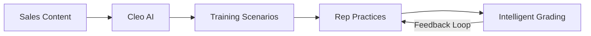

It started with a question that wouldn't leave us alone: why do sales teams keep losing deals they should be winning?

We spent the first few days of the buildathon just talking to people. Sales managers, enablement leads, new reps still finding their footing, and veterans who'd seen every training fad come and go. The same pattern kept surfacing.

## The Gap Nobody Talks About

Every company we spoke with had invested in training. Onboarding programs, product certification, methodology workshops — the usual playbook. On paper, it looked solid.

But when we asked reps what actually prepared them for live calls, the answer was almost always the same: trial by fire. They learned by doing it wrong in front of real prospects.

The problem isn't a lack of information. It's a lack of practice. Safe, realistic, repeatable practice.

## A Notebook Full of Signals

We started keeping track of the signals we were hearing:

- **New reps** said they felt "thrown in the deep end" after onboarding
- **Managers** knew who needed coaching but didn't have time to role-play with everyone
- **Enablement teams** created great content that nobody retained because there was no way to apply it
- **Top performers** had developed instincts through years of repetition — but those instincts were locked in their heads

The training infrastructure exists. What's missing is the bridge between knowing and doing.

| What we heard | From whom | Frequency |
|---------------|-----------|-----------|
| "I learn more in one bad call than a week of training" | Sales reps | Nearly universal |
| "I know who's struggling, but I can't coach everyone" | Managers | 8 out of 10 |
| "We build great content — nobody retains it" | Enablement leads | Every company |
| "The best reps just have more reps" | VP Sales | 3 conversations |

## The Moment It Clicked

We were sitting in a coffee shop, replaying a recorded sales call from one of the teams we'd talked to. The rep had all the right product knowledge. She knew the methodology. But when the buyer threw an unexpected objection, she froze for just a beat too long — and the conversation never recovered.

That's when it hit us: what if she could have practiced that exact scenario ten times before it happened for real?

Not a quiz. Not a video. An actual conversation with something that pushes back, changes direction, and makes her think on her feet. Something that's available at 11 PM the night before a big meeting, patient enough to let her try again, and smart enough to tell her what to improve.

## What We're Calling It

We're calling it Cleo. Short, memorable, and it feels like a name you'd give to a trusted teammate — not a piece of software.

Cleo will be an AI training partner. Not a chatbot that quizzes you on product features. A partner that runs realistic sales conversations, adapts to your skill level, and gives you the kind of honest feedback that makes you better.

## What's Next

Here's the high-level architecture we're thinking about:

Week two is about turning this insight into architecture. We know the problem. We know the shape of the solution. Now we need to figure out how to build it — starting with the voice pipeline that makes AI conversations feel natural.

More soon.
