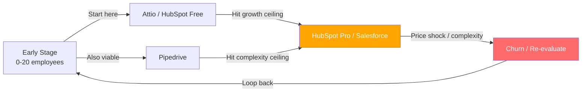
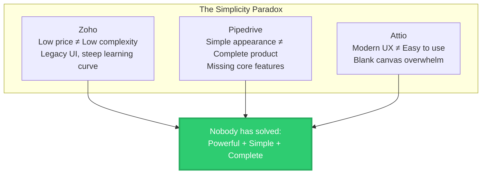
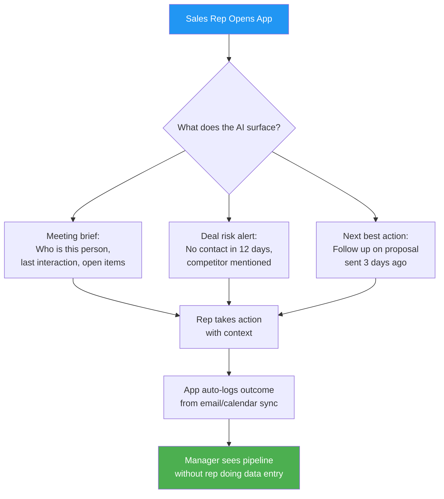

# The CRM Racket: Why Every Major Platform Is Failing Sales Teams
### What happens when a Salesforce architect, a startup growth lead, a VC investor, and a product designer tear apart the six CRMs that define the market — and ask whether anyone should build a seventh

---

## The Setup

Here's a number that should alarm every sales leader: the average enterprise CRM deployment now costs more per year than the salary of the rep forced to use it. Salesforce's own data reveals that 77% of its AI agent deployments fail. HubSpot users routinely describe the jump from free to paid as a "bait-and-switch." Pipedrive shut down its own community forum. And Zoho — the supposed budget option — has an interface that users compare to a "dumpster fire."

CRM software was supposed to help salespeople sell. Instead, the category has devolved into a sprawling, overpriced mess where every major platform optimizes for the buyer who signs the contract — the VP of Sales, the CIO — rather than the human who lives inside the software eight hours a day.

We assembled four people who've seen CRM failure from every angle. We gave them research on all six major platforms. We asked one question: *Is there room for something new?*

**The panel:**

- **Alex Mercer** — Former Salesforce solutions architect, 10 years implementing enterprise CRM. Has seen every failure mode in the book and built workarounds for most of them.
- **Priya Nair** — Growth lead at a 50-person SaaS startup. Has migrated CRMs three times in four years and is currently paying for tools she resents.
- **James Okafor** — VC investor who has evaluated 200+ B2B SaaS companies. Sits on boards of two companies that sell *to* CRM users.
- **Lena Park** — Product designer who has redesigned CRM onboarding flows for six companies. Believes most enterprise software is an act of aggression against its users.

Two rounds. No hedging. No vendor diplomacy.

---

## The Big Six: A Brutal Honest Scorecard

```mermaid
quadrantChart
    title CRM Landscape: Complexity vs. Value Delivered to Sales Reps
    x-axis Low Complexity --> High Complexity
    y-axis Low Value to Reps --> High Value to Reps
    quadrant-1 Powerful but Painful
    quadrant-2 The Sweet Spot (Empty)
    quadrant-3 Avoid
    quadrant-4 Simple but Incomplete
    Salesforce: [0.92, 0.55]
    Dynamics 365: [0.88, 0.48]
    HubSpot: [0.65, 0.62]
    Zoho: [0.72, 0.38]
    Pipedrive: [0.30, 0.52]
    Attio: [0.38, 0.60]
```

**Salesforce** — The category king that became a category tax. Technically capable of anything; practically accessible to almost no one without a certified admin. Agentforce AI has signed 8,000 deals against a stated goal of one billion agents. The complexity-value paradox is complete: it can do everything except make a sales rep's day easier.

**HubSpot** — The best loss leader in SaaS history, followed by one of the industry's most aggressive pricing cliffs. Free tier is excellent. The jump to Professional — $500+/month with mandatory onboarding fees — is the CRM equivalent of a bait-and-switch. Breeze AI lives in a walled garden and can't see outside HubSpot data.

**Pipedrive** — Built the best pipeline UI in the market, then let private equity hollow out everything around it. No marketing automation. No branching logic in workflows. No customer support tools. Vista Equity Partners acquired it in 2020; the SMB community forum was shut down in July 2025. The playbook is textbook.

**Zoho** — The paradox of the market. Priced for small businesses ($14-52/user/month), complexity designed for enterprise IT teams. Users describe the interface as overwhelming. Zia AI runs on open-source models and struggles with anything off-script. The target customers are the least equipped to manage its demands.

**Microsoft Dynamics 365** — A CRM for organizations that have already fully surrendered to the Microsoft ecosystem. Copilot AI is promising but region-locked, language-limited, and restricted by environment type. True total cost of ownership: a $50K/year license typically requires $150-250K in implementation costs. Read that again.

**Attio** — The most interesting player and the most frustrating. Architecturally closer to Notion than Salesforce, with a genuine AI-integrated data model. But it solves the 0-50 employee CRM problem elegantly while leaving growth-stage teams stranded. No real mobile app. Immature integration ecosystem. Weak reporting. Companies graduate off Attio at exactly the moment they need CRM the most.

---

## Round 1: Opening Shots

### Alex Mercer | "I've Spent a Decade Building Workarounds for Software That Shouldn't Need Them"

I've made a very good living implementing Salesforce. I need everyone here to understand what that actually means. It means the product is so complex that companies pay people like me $200-300 an hour to make it do things it should do out of the box. That's not a business model for a CRM — that's a business model for a consulting firm.

The complexity-value paradox is real. Salesforce and Dynamics 365 can model virtually any business process. Both require dedicated technical staff. Both have implementation costs that dwarf licensing. And both have user interfaces their own customers describe as "dense" and "outdated."

When over 1,100 G2 reviewers cite "missing features" in Salesforce, they're talking about functionality that technically exists but is buried behind so much configuration that it might as well not. Enterprise-grade has become a euphemism for "requires a consultant." When your CRM requires a consultant, your CRM has failed.

### Priya Nair | "I've Been a Customer of Four of These Platforms. They All Failed Me Differently."

Alex, I don't disagree — but you're letting HubSpot and Pipedrive off too easy by focusing on enterprise.

I've migrated my team from HubSpot to Pipedrive to a hybrid Attio stack in four years. Every time, the decision was rational. Every time, six months later, we found the new problem we'd traded the old problem for.

HubSpot's free tier is a masterpiece of product design. It is also the most sophisticated pricing trap in the SaaS industry. You build muscle memory, import your contacts, your team learns the workflows — and then you hit the ceiling. $500/month with mandatory onboarding fees. Annual lock-in. Contact-based pricing that scales unpredictably. One user reported $600/month just for 20,000 contacts.

Pipedrive felt like the answer. Clean, fast, sales-focused. Then we discovered there's no if/else branching in automations. No multi-org linking. The "AI-first 2025 strategy" delivered suggestions for when to follow up, not actual automation. And then they shut down the community forum where we went for help.

**The dirty secret of the CRM market: every platform that looks affordable upfront has a monetization trap in the middle.**

### James Okafor | "The Market Map Tells a Clear Story — If You Know How to Read It"

I want to push back on both of you slightly. The pricing criticism is real, but it misses the deeper structural problem: **these platforms were all designed in a different era of selling.**



Every company cycles through this loop. Salesforce was built when CRM meant "database for your sales reps to populate." HubSpot was built when CRM meant "marketing funnel management." None of them were built for how B2B selling works in 2026 — async, mobile, AI-assisted, with selling happening across LinkedIn DMs, Slack, Zoom, and email simultaneously.

Attio is the only platform with a modern architectural assumption at its core: the relationship graph should build itself from actual communication. But it hasn't solved the growth-stage problem. Companies start on Attio and graduate to HubSpot or Salesforce past 50 employees. The platform that breaks this loop wins the market.

### Lena Park | "Every CRM I've Redesigned Was Designed for the Wrong Person"

I need to add something all three of you are dancing around: **CRM failure is a design failure.** Not a change management failure. Not a training failure.

When Salesforce reports 77% Agentforce deployment failure, the instinct is to blame data quality. But the root cause is that the UI was designed for administrators, not salespeople. Every interaction optimizes for data capture completeness, not for the rep's next 60 seconds.

Zoho is the extreme case study. Priced like a simple tool, designed like a legacy enterprise platform, sold to customers who don't have IT departments. I've redesigned onboarding flows for Zoho customers — the problem isn't that users are unsophisticated, it's that the product actively resists them.

And Attio — the most interesting design case — got something right that the others didn't: it started from the user's mental model, not from the data model. But flexibility became complexity. A blank canvas is not simplicity. **It's complexity wearing a turtleneck.**

---

## Round 2: The Debate Turns

### The AI Argument: James vs. Lena vs. Alex

**James:** Everyone's dunking on CRM AI, but the technology has genuinely changed. Automatic data capture, conversation intelligence, predictive scoring — these aren't demos anymore. Attio's AI is embedded in the data model, not bolted on. The enrichment and workflow automation are real.

**Lena:** They work in controlled environments. Salesforce's Agentforce has a 77% failure rate. HubSpot's Breeze can only see data inside HubSpot — not Slack, not Google Docs, not the dozen tools your team actually uses. An AI that sees one-tenth of your work context isn't intelligence. It's a parlor trick with good branding.

**Alex:** Attio's AI is real but shallow. Useful for data enrichment, sluggish for lead scoring, absent for predictive analytics. No deal risk scoring. No revenue forecasting. Zoho's Zia runs on open-source models and struggles with anything off-script. Pipedrive's AI is advisory at best. Dynamics 365 Copilot is region-locked. The honest assessment across all six: no major CRM has shipped AI that fundamentally changes how a salesperson works. They've shipped AI features that justify price increases. That's different.

**James:** Which is *exactly* why there's an opportunity. The technology exists. The incumbents can't deploy it because their architectures won't support it. A new entrant building AI-native from day one, with access to the full communication stack — email, calendar, Slack, calls — could deliver what the incumbents only promise. That's not a critique. That's an investment thesis.

### The Simplicity Paradox: All Four Weigh In

**Lena:** Every CRM that claims simplicity is lying. Zoho prices at $14/user and delivers endless tabs. Pipedrive looks simple because it's incomplete — no marketing, no support, no branching logic. Attio feels modern but trades legacy complexity for blank-canvas complexity. Nobody has cracked the design problem of making a genuinely powerful CRM that a rep can master in a day.

**Priya:** I don't want *simple*. I want *opinionated*. Ship me a pipeline that works. Ship me automation templates that match how people actually sell. Let me customize later. Attio gives me a blank canvas and says "build anything." I don't want to build anything. I want to sell.

**Alex:** The best products I've ever seen aren't simple or complex — they're opinionated. Strong defaults, overridable when needed. Every CRM in this market either makes no choices (Attio, Salesforce) or makes the wrong ones (Pipedrive capping features, HubSpot gating reporting).

**Lena:** That's the product principle. Opinionated defaults, not blank canvases. Not infinite options.



### Priya Challenges Alex: "Complexity Isn't the Disease — It's the Symptom"

**Priya:** Alex, you keep talking about complexity like it's a design choice. It's not. Salesforce is complex because businesses are complex. The question isn't "can we make CRM simple?" — it's "can we make the *right things* simple while keeping the power available?"

**Alex:** That's exactly what Salesforce tells itself. "Our customers need this complexity." No — your *consultants* need this complexity. I watched a 200-person company spend $150K configuring Salesforce to do what Pipedrive does out of the box, plus three things they actually needed. That's a $150K tax on three features.

**Priya:** Fair. But Pipedrive couldn't do those three things, and that's why we left. The issue isn't that Salesforce is complex — it's that there's no middle ground between "too simple to be useful" and "too complex to be usable." That middle ground is the entire opportunity.

---

## The Verdict: Is There Room for a New Player?

All four panelists converged: **unequivocally yes.** And the gap is more specific than "better CRM."

**James** framed the investment thesis: "The target is the individual sales rep and frontline manager at 10-200 person companies. PE consolidation is creating refugees from Pipedrive. HubSpot's pricing cliff is creating orphans at growth stage. AI maturity makes automatic data capture and intelligent next-actions finally viable. And the mobile-first generation entering sales roles will not accept software designed for 2008 desktops. This market is being *created* right now."

**Priya** defined the experience: "It should feel like a fast, intelligent assistant on your phone. A CRM that knows who I talked to, what was said, and what to do next — without me typing anything. Less enterprise software, more the best consumer app you've ever used, but for selling."

**Alex** defined the anti-pattern: "Don't try to be Salesforce. Don't build a platform. Don't create an ecosystem. Don't serve IT departments. Build for the human who uses it daily and currently resents it. The companies that fail will try to creep toward complexity because enterprise buyers wave big checks. That's what happened to every CRM in this study."

**Lena** defined the moment: "The generation that grew up on Instagram and TikTok will not accept software that feels like it was designed in 2008. The first CRM that feels as good as a consumer app wins the next generation of sellers."



---

## What "Simple, Fast, AI-First" Actually Means

The panel translated the research into six non-negotiable product principles — less a feature list, more a set of constraints that define what this product must be and, equally important, what it must refuse to become.

| Principle | What It Means | Who Gets It Wrong Today |
|---|---|---|
| **Zero-entry data capture** | Email, calendar, calls sync automatically. Relationship graph from communication, not forms. | Everyone — Salesforce needs manual entry, Attio partially solves it |
| **AI that works on Day 1** | Meeting briefs, follow-up timing, deal risk. Not six-month forecasting models. | Salesforce (needs clean data), HubSpot (walled garden AI) |
| **Mobile-first UX** | Core workflows faster on phone than desktop. Phone is the primary interface. | Attio (no real app), Zoho (terrible app), Dynamics (desktop-only) |
| **Opinionated defaults** | Ships with pipeline, reports, and automation that work out of the box. | Attio (blank canvas), Salesforce (requires consultants) |
| **Transparent flat pricing** | One price, per user, per month. No add-ons, no contact scaling, no lock-in. | Pipedrive (add-on hell), HubSpot (contact-based scaling) |
| **Cross-stack AI vision** | Sees Slack, email, calendar, Zoom — not just CRM data. Twenty deep integrations, not 2,000 shallow ones. | HubSpot (walled garden), every incumbent platform |

---

## Where the Panel Landed

| | Opening Position | Final Verdict |
|---|---|---|
| **Alex** | "CRM complexity is a consulting industry disguised as software" | "The gap is real — opinionated defaults plus AI-native architecture is the formula" |
| **Priya** | "I've migrated three times and I'm still unhappy" | "Build it for the rep, not the buyer. Phone-first. I'd switch tomorrow." |
| **James** | "The market map shows a clear structural gap" | "PE refugees + HubSpot orphans + AI maturity = investable thesis right now" |
| **Lena** | "Every CRM is designed for the wrong person" | "Consumer-grade design meets sales workflow. First one to ship it wins." |

---

*The CRM market is an $80+ billion industry built on a broken premise: give salespeople a database to fill out, and good things will happen. They won't. They never did.*

*Four people who started from radically different positions — an architect, a customer, an investor, and a designer — converged on the same gap, the same target user, and the same product principles. That convergence is itself a signal. When four independent lenses point to the same thing, from first principles, it's worth listening.*

*The research is clear. The gap is real. The only question is who builds it first.*
