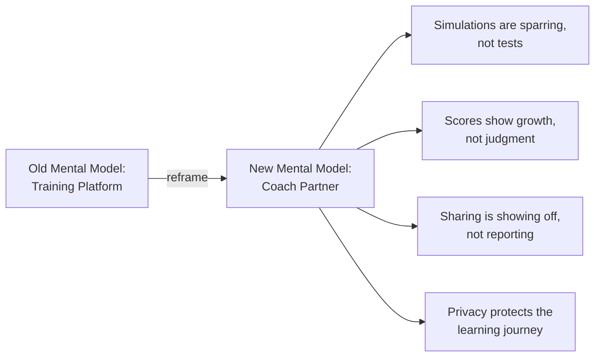
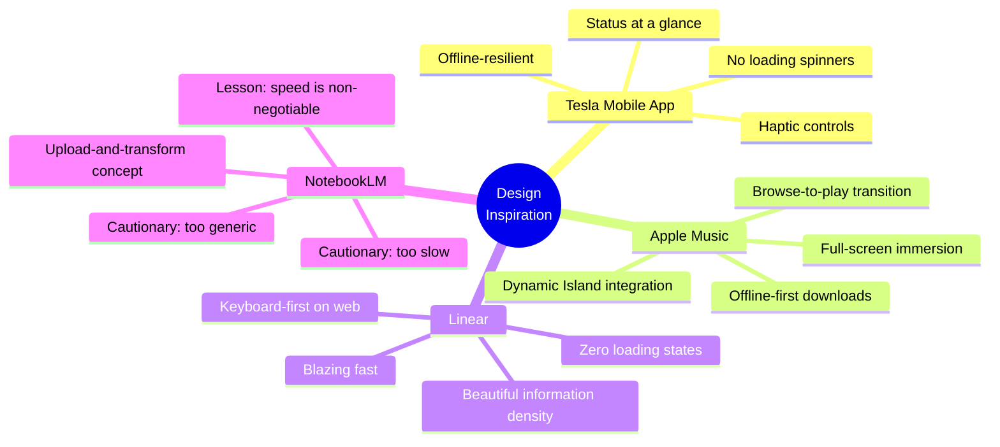
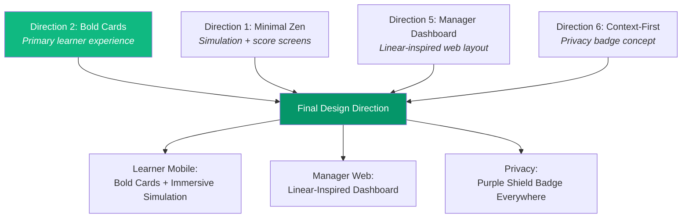
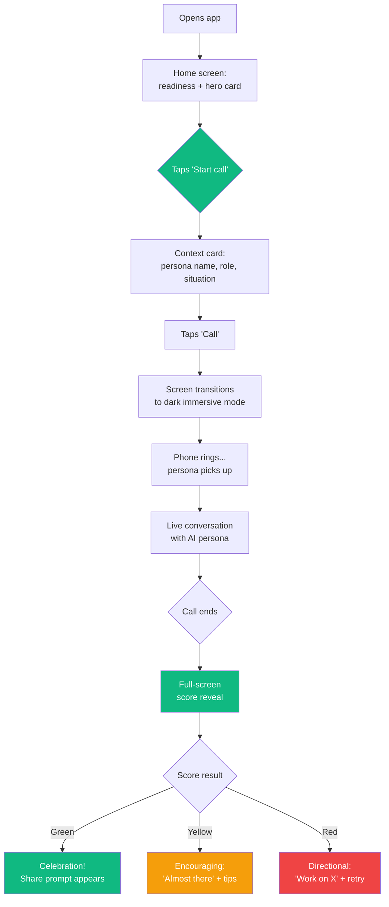
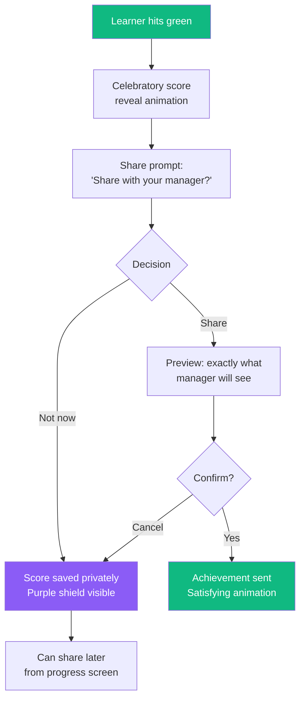
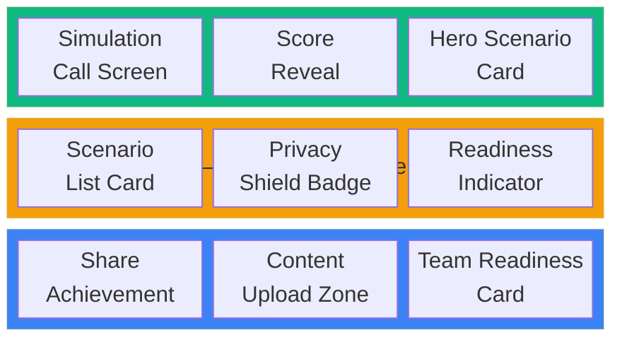

# Designing the Experience
**From Problem Space to Pixel-Ready UX Specification**
Week 2 Design Deliverable — ProductBC Build-a-Thon 2026

---

## Week 2 Summary

Last week we validated our problem space. This week we designed the experience. We went from sticky notes and whiteboard sketches to a full UX design specification — color systems, component hierarchies, user journey flows, accessibility strategy, and six distinct visual directions we debated, merged, and refined.

The biggest shift this week was moving from *what* Cleo should do to *how it should feel*. We spent the first half of the week mapping complexity, the second half generating and evaluating design directions with AI, and the final push synthesizing everything into a spec that's ready for implementation.

Here's how we got there.

---

## 1. Mapping Complexity: The Cynefin Framework

Before we touched a single pixel, we needed to understand what kind of problem we were actually solving. Not all parts of Cleo are equally hard — and the design approach should match the complexity of each challenge.

We used the **Cynefin Framework** to categorize the key challenges across four domains:

| Domain | Challenge | Design Implication |
|---|---|---|
| **Complex** (probe-sense-respond) | Building call simulations that feel real — quick, accurate, human-like | Requires iterative experimentation. We can't spec this perfectly upfront; we need to build, test, and adjust. |
| **Complicated** (sense-analyze-respond) | Recognizing which content needs to be updated or deleted | Solvable with expertise. Clear rules + good UX for content management. |
| **Complicated** | Obtaining company data when no documentation exists | Needs analysis — email ingestion, meeting recordings, alternative capture methods. |
| **Chaotic** (act-sense-respond) | Creating AI personas that match real customer characteristics across industries | Novel territory. No best practice exists — we need to act fast, learn from what works, and iterate. |

The Cynefin mapping gave us permission to treat different parts of the product differently. The simulation engine lives in the complex domain — we'll probe and iterate. The content management system lives in the complicated domain — we can plan it methodically.

---

## 2. Finding the Core: What Is Cleo, Really?

Before designing screens, we forced ourselves to answer one question:

> **"If Cleo is one thing, what is it?"**

The answer we landed on: **a sparring partner, not a testing system.**

The mental model isn't "training software." It's a coach who hits you tough shots so you're ready for the match. Like a tennis partner who doesn't let you off easy — not a referee keeping score.

This reframe changed everything downstream:

We defined five experience principles that would guide every design decision:

1. **Instant, always** — Offline-first. No loading states, no "connecting..." The app is ready the moment you open it.
2. **Feels real, not like training** — The simulation is the product. Minimal chrome. Closer to a phone call than a learning app.
3. **Opinionated and delightful** — Every interaction is intentionally designed. Micro-animations, haptics, Dynamic Island. Craft is the brand.
4. **Progress, not pressure** — Scoring motivates growth. Privacy protects the journey. Sharing is a celebration, not a requirement.
5. **Platform-native, not cross-platform** — Leverage everything iOS and Android offer. This is why it's native.

---

## 3. The Design Process: Generating and Evaluating with AI

This is where the week got interesting. Rather than starting from a blank Figma canvas, we used a structured AI-assisted design process that let us explore more directions, faster, than a two-person team normally could.

### Step 1: Inspiration Analysis

We started by studying four products that nail the *feeling* we're after — not because they're in our category, but because they've solved similar UX problems:

**What we took from each:**
- **Tesla:** Open the app, instantly know everything. No digging required. We applied this to the learner home screen — readiness status, recent sessions, and next recommended practice all visible without navigating.
- **Apple Music:** The transition from browsing to being *in* a simulation should feel like tapping play — instant immersion. Full-screen, distraction-free.
- **Linear:** The manager-facing web dashboard should channel Linear's speed and intentionality. Dense information presented beautifully.
- **NotebookLM:** Same "upload and transform" promise, but executed with speed and specificity. Where NotebookLM feels sluggish, Cleo must feel instant.

### Step 2: Anti-Pattern Identification

Equally important was defining what we would *not* do. We built an explicit anti-pattern list:

- No enterprise dashboard bloat (no 47-tab navigation)
- No onboarding wizards or tutorials (Tesla doesn't explain itself; neither should Cleo)
- No completion-theater UX (no badge collections, no confetti for finishing mandatory modules)
- No generic AI interactions (no "I'm an AI assistant, how can I help you?" — the AI persona has a name, a mood, a personality)
- No NotebookLM-style processing delays (content transformation must feel instant)

### Step 3: Six Visual Directions

With principles and inspiration locked in, we generated six distinct visual directions using our AI-assisted design workflow. Each direction explored a different approach to the same core experience:

| # | Direction | Philosophy |
|---|---|---|
| 1 | **Minimal Zen** | Ultra-clean, spacious, Tesla-inspired. Readiness score as focal point. |
| 2 | **Bold Cards** | Large hero cards, strong CTAs, fintech-inspired energy. |
| 3 | **Dark Immersive** | Fully dark, gaming/audio UI, performance dashboard feel. |
| 4 | **Playful Coach** | Warm, motivational, fitness-app-inspired streaks and progress. |
| 5 | **Manager Dashboard** | Linear-inspired density for team readiness views. |
| 6 | **Context-First** | Event-aware suggestions, prominent privacy badge, weekly rhythm. |

We built an interactive HTML showcase to compare them side-by-side. Here are three of the directions:

### Direction 2: Bold Cards — The Winner

Large, colorful hero card that surfaces the most relevant practice scenario. Emerald green gradient hero with white CTA button — impossible to miss. The primary action (start a practice call) dominates the screen. Action-first design.

### Direction 4: Playful Coach

The friendliest direction — motivational language, streak tracking, warm gradients. Feels like a fitness app for your sales skills. "Hey Jordan!" with a 3-day streak and progress chips. Encouragement-first without being childish.

### Direction 6: Context-First

The most contextually aware direction. The app knows what you need to practice based on upcoming events (conferences, calls, launches). Privacy is visually prominent — the purple shield badge is always visible. Weekly activity gives a personal rhythm without surveillance.

### Step 4: The Merge Decision

We didn't pick one direction and discard the rest. We merged the best elements:

**The rationale:**
- **Bold Cards** for the learner home because it's action-first — one tap to practice, under 10 seconds to hearing a voice
- **Minimal Zen's dark immersive screens** for the actual simulation — the call experience should feel like picking up the phone, not using an app
- **Manager Dashboard's density** for the web experience — managers need information, not pretty cards
- **Context-First's privacy badge** — the purple shield carries into every screen, making privacy visible at all times

---

## 4. The Core Loop: User Journey Design

With the visual direction locked, we mapped the critical user journeys. The most important one — the learner's first practice session — had to be flawless:

**Key design decisions in this flow:**
- No onboarding tutorial — the app is self-evident
- Hero card on home screen means the first action is obvious
- Under 10 seconds from app open to hearing a voice
- Score reveal is the emotional payoff — animated, celebratory, forward-looking
- Share prompt only appears on green scores — never pressure on yellow/red
- Private by default — the purple shield is always visible

### The Privacy-First Share Flow

This was one of the harder design problems: how do you make sharing feel like showing off instead of reporting?

The key insight: transparency creates trust. The learner sees *exactly* what the manager will see before confirming. "Not now" is never judged. The purple shield badge reinforces safety at every step.

---

## 5. Design System: The Foundations

We built a complete design system specification covering all three platforms. Here are the key decisions:

### Color System

| Role | Color | Hex | Usage |
|---|---|---|---|
| Primary | Emerald | `#10B981` | Brand, CTAs, green scores, celebration |
| Primary Dark | Deep Emerald | `#059669` | Buttons, active states |
| Score Yellow | Warm Amber | `#F59E0B` | Encouraging, not warning |
| Score Red | Soft Red | `#EF4444` | Directional, not alarming |
| Privacy | Purple | `#8B5CF6` | Shield badge, privacy indicators |
| Simulation BG | Deep Dark | `#030712` | Immersive call screens |

### Platform Strategy

We made the deliberate choice to go **platform-native**, not cross-platform:

| Platform | Technology | Design Approach |
|---|---|---|
| iOS (primary) | SwiftUI | Custom components, haptics, Dynamic Island, Apple Watch |
| Android | Jetpack Compose | Material 3 base, heavily customized to match Cleo identity |
| Web | Tailwind + shadcn/ui | Linear-inspired, manager-focused, keyboard shortcuts |

### Component Priority

We identified 10 custom components and ordered them by criticality:

The P0 components — Simulation Call Screen, Score Reveal, Hero Scenario Card, and Context Card — deliver the complete practice-to-score experience. Everything else builds on top of that loop.

---

## 6. What We Learned About AI-Assisted Design

This week was a real test of using AI as a design collaborator. Here's what worked and what we'd do differently:

**What worked well:**
- **Generating multiple directions fast** — Six visual directions in a day. A two-person team couldn't have explored that breadth manually.
- **UX writing at scale** — Error messages, empty states, accessibility labels. AI generated first drafts that we edited for tone.
- **Structured specification** — The final UX spec is comprehensive and implementation-ready. AI helped maintain consistency across 1,000+ lines of specification.
- **Pattern analysis** — AI was excellent at analyzing inspiring products and extracting transferable patterns.

**What required human judgment:**
- **The merge decision** — Which elements from which direction to combine required taste, not logic.
- **Emotional calibration** — How a red score should *feel* (directional, not alarming) can't be specified by an AI — it has to be felt.
- **Anti-patterns** — Knowing what *not* to do (no badge walls, no completion theater) came from our experience with bad enterprise software, not from AI.
- **Privacy as emotion** — The insight that privacy isn't a feature but an *emotion* came from human empathy with the learner's vulnerability during practice.

---

## 7. Next Steps — Week 3

- **Build the interactive prototype** — Clickable flows for the core practice loop (home -> scenario -> call -> score -> share)
- **User testing** — Put the prototype in front of 5-8 target users and test: Does the flow feel natural? Is "under 10 seconds to a voice" achievable in practice?
- **Technical architecture** — Start mapping the design specification to implementation: API contracts, voice synthesis pipeline, scoring model
- **Component development** — Begin building the P0 components in SwiftUI

---

## The Bottom Line

Week 1 was about *should we build this?* Week 2 was about *what should it feel like?*

We went from a validated problem space to a design specification that covers the complete learner and manager experience across three platforms. The key insight that drove everything: Cleo isn't training software. It's a sparring partner. That reframe — from compliance to confidence, from testing to coaching, from reporting to showing off — shaped every design decision we made.

The UX spec is done. Now we build it.
